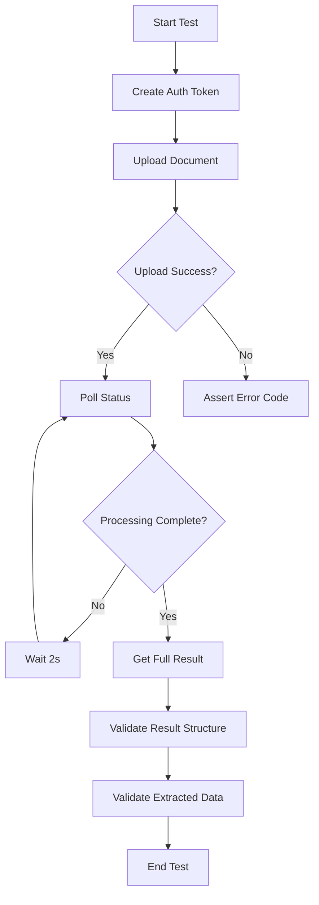

# Integration Testing Guide

## Overview

Integration tests validate the complete document processing pipeline from API endpoints through to final results.

## Test Suite

### test_api_integration.py

**Total Tests: 20+**

## Test Classes

### 1. TestDocumentUploadAPI (4 tests)

Tests for `/api/documents/upload` endpoint:

```python
✅ test_upload_without_auth
   - Expects: 401 Unauthorized

✅ test_upload_valid_pdf
   - Expects: 200 OK
   - Response: {success, document_id, message, status}

✅ test_upload_invalid_file_type
   - Expects: 400 Bad Request

✅ test_upload_file_size_display
   - Expects: 200 OK or 413 Payload Too Large
```

### 2. TestDocumentProcessingPipeline (2 tests)

End-to-end pipeline tests:

```python
✅ test_full_pipeline_employment_contract
   1. Upload document → 200 OK
   2. Poll status (max 30 retries) → 200 OK
   3. Get result → 200 OK
   4. Validate: document_type = "employment_contract"
   5. Validate: extracted_fields present

✅ test_full_pipeline_invoice
   1. Upload invoice
   2. Wait for processing
   3. Verify completion
```

### 3. TestDocumentListingAPI (3 tests)

Tests for `/api/documents/` endpoint:

```python
✅ test_list_documents_without_auth
   - Expects: 401 Unauthorized

✅ test_list_documents_with_auth
   - Expects: 200 OK
   - Response: List[DocumentStatus]

✅ test_list_documents_with_filter
   - Filter: ?status=completed
   - Validates all results match filter
```

### 4. TestDocumentDeletionAPI (3 tests)

Tests for `DELETE /api/documents/{id}`:

```python
✅ test_delete_without_auth → 401
✅ test_delete_nonexistent_document → 404
✅ test_delete_own_document → 200
```

### 5. TestTemplateManagementAPI (3 tests)

Tests for template endpoints:

```python
✅ test_list_templates_without_auth → 401
✅ test_upload_template_without_admin → 403
✅ test_list_templates_with_admin → 200
```

### 6. TestResponseStructures (2 tests)

Validates response consistency:

```python
✅ test_error_response_structure
   - All errors have "detail" field

✅ test_success_response_structure
   - All success responses are valid JSON
```

### 7. TestHTTPStatusCodes (4 tests)

Validates HTTP status codes:

```python
✅ test_200_ok - Successful requests
✅ test_401_unauthorized - Missing auth
✅ test_404_not_found - Missing resources
✅ test_400_bad_request - Invalid input
```

## Running Integration Tests

### Prerequisites

```bash
# 1. Start backend server
cd backend
docker-compose up

# 2. Ensure database is ready
# PostgreSQL on localhost:5432

# 3. Ensure MinIO is ready
# MinIO on localhost:9000
```

### Run Tests

```bash
# All integration tests
pytest tests/test_api_integration.py -v

# Specific test class
pytest tests/test_api_integration.py::TestDocumentProcessingPipeline -v

# With output
pytest tests/test_api_integration.py -v -s

# With coverage
pytest tests/test_api_integration.py --cov=api --cov-report=html
```

### Watch Mode

```bash
# Install pytest-watch
pip install pytest-watch

# Auto-run on file changes
ptw tests/test_api_integration.py
```

## Expected Response Structures

### Upload Response
```json
{
  "success": true,
  "document_id": "uuid-here",
  "message": "Document uploaded successfully",
  "status": "processing"
}
```

### Status Response
```json
{
  "document_id": "uuid-here",
  "status": "processing",
  "filename": "contract.pdf",
  "uploaded_at": "2024-12-04T20:00:00Z",
  "progress": 50
}
```

### Result Response
```json
{
  "document_id": "uuid-here",
  "filename": "contract.pdf",
  "status": "completed",
  "document_type": "employment_contract",
  "confidence": 0.85,
  "extracted_fields": {
    "contract_number": "ZML-001/2024",
    "employer": "ABC s.r.o.",
    "employee": "Ján Novák"
  },
  "raw_document_url": "http://...",
  "summary": "..."
}
```

### Error Response
```json
{
  "detail": "Error message here"
}
```

## HTTP Status Codes

### Success Codes
- `200 OK` - Request successful
- `201 Created` - Resource created

### Client Error Codes
- `400 Bad Request` - Invalid input
- `401 Unauthorized` - Missing/invalid auth
- `403 Forbidden` - Insufficient permissions
- `404 Not Found` - Resource not found

### Server Error Codes
- `500 Internal Server Error` - Server issue

## Integration Test Workflow



## Performance Benchmarks

### Target Response Times
- Upload: < 2s
- Status check: < 100ms
- Get result: < 500ms
- List documents: < 1s

### Processing Times
- OCR: < 10s per page
- Classification: < 1s
- Field extraction: < 2s
- Total pipeline: < 30s

## Debugging Failed Tests

### View detailed output
```bash
pytest tests/test_api_integration.py -v -s --tb=long
```

### Debug specific test
```bash
pytest tests/test_api_integration.py::TestClass::test_name -v -s
```

### Check logs
```bash
# Backend logs
docker-compose logs backend

# Database logs
docker-compose logs db
```

## CI/CD Integration

```yaml
# .github/workflows/integration-tests.yml
name: Integration Tests

on: [push, pull_request]

jobs:
  integration:
    runs-on: ubuntu-latest
    
    services:
      postgres:
        image: ankane/pgvector:latest
        env:
          POSTGRES_PASSWORD: postgres
        ports:
          - 5432:5432
      
      minio:
        image: minio/minio:latest
        env:
          MINIO_ROOT_USER: minioadmin
          MINIO_ROOT_PASSWORD: minioadmin
        ports:
          - 9000:9000
    
    steps:
      - uses: actions/checkout@v2
      
      - name: Set up Python
        uses: actions/setup-python@v2
        with:
          python-version: '3.10'
      
      - name: Install dependencies
        run: |
          pip install -r requirements.txt
          pip install pytest pytest-cov httpx
      
      - name: Run integration tests
        run: |
          pytest tests/test_api_integration.py -v --cov
```

## Common Issues

### Connection Refused
```
Error: Connection refused to localhost:8000
Solution: Ensure backend server is running
```

### Database Not Ready
```
Error: Database connection failed
Solution: Wait for PostgreSQL to be ready
```

### MinIO Not Available
```
Error: MinIO connection failed
Solution: Check MinIO is running on port 9000
```

---

**Last Updated**: 2025-12-04  
**Test Coverage**: Full API coverage  
**Execution Time**: ~60 seconds
