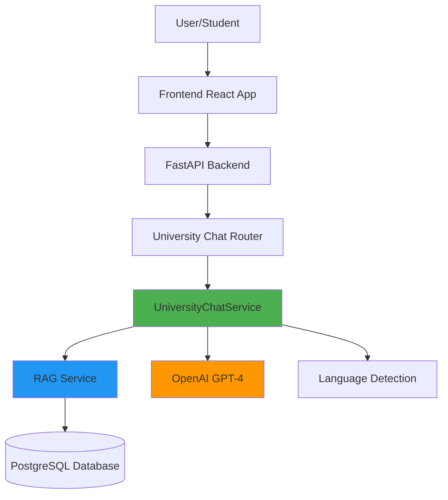
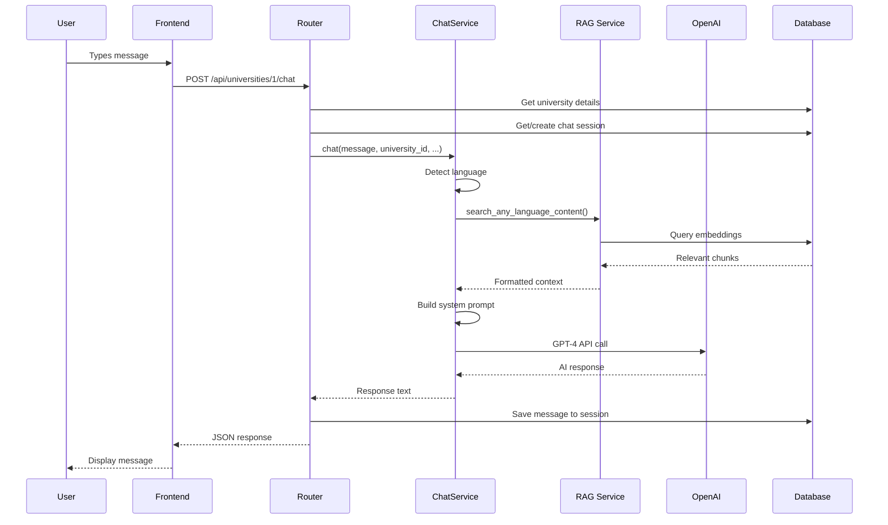

# University Chat System Architecture

## Overview

The University Chat System is an AI-powered conversational assistant that helps prospective students get information about universities. It uses **RAG (Retrieval Augmented Generation)** to provide accurate, context-aware responses based on scraped university data.

---

## System Architecture



---

## Components

### 1. Frontend (`frontend/components/UniversityChatModal.tsx`)

**Purpose:** User interface for chat interaction

**Key Features:**
- Modal dialog for chat
- Message history display
- Real-time typing indicators
- Multi-language support

**Flow:**
1. User clicks "Chat with AI" button
2. Modal opens with university context
3. User types message
4. Frontend sends POST to `/api/universities/{id}/chat`
5. Response displayed in chat

---

### 2. API Router (`backend/api/university_chat.py`)

**Purpose:** HTTP endpoints for chat functionality

**Endpoints:**

#### `POST /api/universities/{university_id}/chat`
- **Input:** `UniversityChatRequest` (message, session_id)
- **Output:** `UniversityChatResponse` (response, session_id)
- **Auth:** None (anonymous)
- **Rate Limit:** None (TODO: add rate limiting)

#### `GET /api/universities/{university_id}/chat/history`
- **Input:** university_id, session_id
- **Output:** Array of messages
- **Auth:** None

**Key Features:**
- ✅ Dependency injection for `UniversityChatService`
- ✅ Error handling with language detection
- ✅ Session management
- ✅ Conversation history persistence

---

### 3. Chat Service (`backend/services/university_chat_service.py`)

**Purpose:** Core AI chat logic with RAG

**Key Methods:**

#### `async chat(...) -> str`
Main chat method that:
1. Detects user's language
2. Searches RAG database for relevant content
3. Falls back to web search if no RAG data
4. Generates system prompt with context
5. Calls OpenAI GPT-4
6. Returns AI response

#### `_detect_language(message: str) -> str`
- Uses `langdetect` library
- Supports 10+ languages
- Defaults to English

#### `_get_system_prompt_with_rag(...) -> str`
- Generates language-specific prompts
- Includes RAG context
- Has fallback prompts when no RAG data

**Supported Languages:**
- 🇺🇦 Ukrainian (uk)
- 🇸🇰 Slovak (sk)
- 🇨🇿 Czech (cs)
- 🇬🇧 English (en)
- 🇵🇱 Polish (pl)
- 🇷🇺 Russian (ru)
- 🇩🇪 German (de)
- 🇫🇷 French (fr)
- 🇪🇸 Spanish (es)
- 🇮🇹 Italian (it)

---

### 4. RAG Service (`backend/services/rag_service.py`)

**Purpose:** Retrieval of relevant university information

**Key Methods:**

#### `async search_any_language_content(...)`
- Searches university content in database
- Uses vector similarity (embeddings)
- Returns top K most relevant chunks
- Language-agnostic (searches in any language)

#### `format_context_for_prompt(...)`
- Formats retrieved content for AI prompt
- Includes URLs for citations
- Limits context length

**Database Tables:**
- `university_rag_content` - Scraped content chunks
- `university_rag_embeddings` - Vector embeddings

---

### 5. Database Models (`backend/main.py`)

#### `University`
```python
- id: int
- name: str
- website_url: str
- description: str
- city: str
- country: str
- is_active: bool
```

#### `UniversityChatSession`
```python
- id: int
- university_id: int
- user_id: int (nullable)
- messages: JSON[]
- context: JSON
- is_active: bool
- session_ended: datetime
```

---

## Data Flow

### Typical Chat Request Flow



---

## Key Design Decisions

### 1. **Why RAG?**
- Universities have lots of specific information (programs, fees, deadlines)
- RAG provides accurate, up-to-date information
- Reduces hallucinations
- Can cite sources

### 2. **Why Language Detection?**
- Platform supports 10 languages
- Users may ask in any language
- AI responds in user's language
- Better UX

### 3. **Why Dependency Injection?**
- Easy to test (can mock `UniversityChatService`)
- Easy to swap implementations
- Follows SOLID principles

### 4. **Why Separate Router?**
- Isolation from `main.py`
- Changes don't affect other endpoints
- Easier to maintain
- Better organization

### 5. **Why Session Management?**
- Preserve conversation context
- Multi-turn conversations
- Better AI responses with history

---

## Error Handling

### Graceful Degradation

1. **No RAG data** → Falls back to web search
2. **Web search fails** → Uses generic prompt
3. **OpenAI fails** → Returns error message in user's language
4. **Database error** → Logs error, returns user-friendly message

### Error Messages

All errors return messages in detected user language:
```python
{
  'uk': 'Вибачте, сталася помилка...',
  'sk': 'Prepáčte, nastala chyba...',
  'en': 'Sorry, an error occurred...',
  # ... 7 more languages
}
```

---

## Performance Considerations

### Optimization Strategies

1. **RAG Search**
   - Limited to top 5 results
   - Vector similarity for speed
   - Cached embeddings

2. **OpenAI API**
   - Async calls (non-blocking)
   - Timeout handling
   - Token limit management

3. **Database**
   - Indexed queries
   - Session caching
   - Connection pooling

---

## Security

### Current Implementation

- ✅ Input validation (Pydantic models)
- ✅ SQL injection protection (SQLAlchemy ORM)
- ✅ Anonymous sessions (no user data required)
- ⚠️ No rate limiting (TODO)
- ⚠️ No authentication (public access)

### Recommendations

1. Add rate limiting (e.g., 10 requests/minute per IP)
2. Add CAPTCHA for abuse prevention
3. Monitor OpenAI costs
4. Add request logging

---

## Testing

### Test Coverage

- ✅ Unit tests (`test_university_chat_service.py`) - 23 tests
- ✅ Integration tests (`test_university_chat_integration.py`)
- ✅ Smoke tests (`test_university_chat_smoke.py`) - 14 tests

### Running Tests

```bash
# All tests
python backend/run_university_chat_tests.py

# Specific test file
pytest backend/tests/test_university_chat_service.py -v

# With coverage
pytest backend/tests/test_university_chat*.py --cov=services.university_chat_service
```

---

## Deployment

### Environment Variables Required

```bash
OPENAI_API_KEY=sk-...        # Required
DATABASE_URL=postgresql://... # Required
```

### Docker Deployment

System runs in Docker containers:
- `backend` - FastAPI application
- `postgres` - Database
- `frontend` - Next.js application

---

## Monitoring & Logging

### Current Logging

```python
print(f"DEBUG: Context length: {len(context)} chars")
print(f"⚠️ Insufficient RAG data, searching web...")
print(f"✅ Found web results: {len(results)} chars")
```

### Recommended Improvements

1. Use `structlog` for structured logging
2. Add metrics (Prometheus)
3. Track OpenAI costs
4. Monitor response times
5. Alert on errors

---

## Future Enhancements

### Planned Features

1. **User Authentication**
   - Save chat history per user
   - Personalized responses

2. **Advanced RAG**
   - Multi-modal (images, PDFs)
   - Better chunking strategies
   - Hybrid search (keyword + vector)

3. **Analytics**
   - Most asked questions
   - Popular universities
   - User satisfaction metrics

4. **Multilingual RAG**
   - Translate content to all languages
   - Language-specific embeddings

---

## Troubleshooting

See [`UNIVERSITY_CHAT_TROUBLESHOOTING.md`](./UNIVERSITY_CHAT_TROUBLESHOOTING.md) for common issues and solutions.

---

## Contact & Support

For questions or issues:
- Check troubleshooting guide
- Review test files for examples
- Check logs in `backend/logs/`
